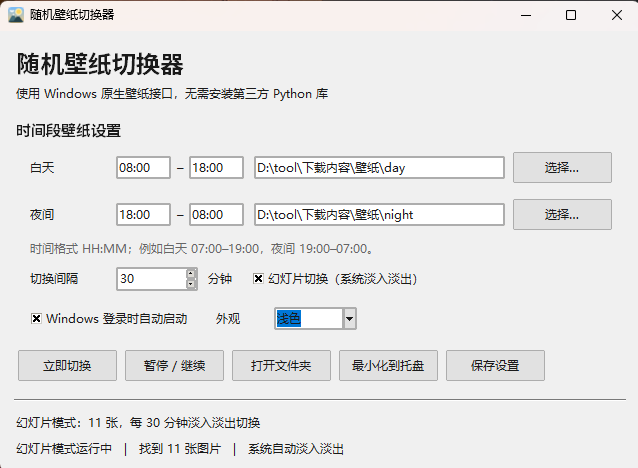

# 随机壁纸切换器 WallpaperSwitcher

一个 Windows 托盘小工具:按**白天 / 夜间时段**自动从指定文件夹随机切换桌面壁纸,支持 Windows 原生**幻灯片淡入淡出**、开机自启、深色主题。**单文件、零第三方依赖**,只用 Python 标准库 + ctypes 直调 Win32 API。

Random desktop wallpaper switcher for Windows — day/night schedules, native slideshow cross-fade, tray icon, startup link, dark mode. One file, no third-party dependencies (stdlib + ctypes only).


## 功能 Features

- ⏰ **时段壁纸**:白天 / 夜间各绑一个文件夹,支持跨午夜(如夜间 19:00–07:00)
- 🔀 **随机切换**:洗牌袋算法,一轮内不重复;可设 1 分钟 ~ 7 天间隔
- 🎞️ **幻灯片模式**:接入 Windows `IDesktopWallpaper` 原生引擎,切换带系统级淡入淡出过渡
- 🌙 **深色主题**:跟随系统 / 浅色 / 深色三档,标题栏同步沉浸深色
- 📌 **系统托盘**:纯 ctypes 手写托盘图标与右键菜单,白天/夜晚图标自动切换,Explorer 重启后自动重挂
- 🚀 **开机自启**:创建当前用户"启动"文件夹快捷方式(非注册表 Run,无需管理员权限)
-  **单实例**:Mutex 保证只跑一个;重复启动会唤起已有窗口
- 💾 **原子写配置**:`%APPDATA%\WallpaperSwitcher\config.json`,写临时文件再替换,不怕中途断电

## 截图 Screenshots

> 把窗口截图放到 `docs/` 目录并在此引用,例如:
> 

## 快速开始 Quick Start

### 方式一:下载预编译版

到 [Releases](../../releases) 下载 `WallpaperSwitcherTray.zip`,解压后运行 `WallpaperSwitcherTrayV7.exe`。

> 首次运行若被 Windows SmartScreen 拦截,点"仍要运行"即可(程序未做代码签名)。

### 方式二:源码运行

需要 Python 3.12+ 且自带 tkinter(官方 Windows 安装包默认包含):

```bash
python wallpaper_switcher.py            # 显示窗口启动
python wallpaper_switcher.py --background   # 静默进托盘
```

## 从源码构建 Build from source

```bash
pip install -r requirements-build.txt   # 只有 pyinstaller
pyinstaller wallpaper_switcher.spec --noconfirm
# 产物在 dist/WallpaperSwitcherTrayV7/
```

构建产物是 onedir(含 `_internal/`),整个文件夹一起分发。

## 开发 Development

```bash
python -m py_compile wallpaper_switcher.py   # 语法检查
python tests/test_logic.py                   # 纯逻辑单测(洗牌袋/时间解析/原子写配置)
python tests/test_tray.py                    # 托盘创建回归测试(需真实桌面会话)
python tests/test_theme.py                   # 主题引擎 GUI 测试
```

CI 会在每次 push 时自动跑语法检查与 PyInstaller 构建,并上传可运行的 exe 作为构建产物(见 `.github/workflows/build.yml`)。

## 实现要点 How it works

| 能力 | 实现 |
|---|---|
| 设置壁纸(单张) | `user32.SystemParametersInfoW(SPI_SETDESKWALLPAPER)` |
| 幻灯片(淡入淡出) | `IDesktopWallpaper` COM(vtable 直调,ctypes 手写)+ `SHCreateShellItemArrayFromIDLists` |
| 托盘图标 | `Shell_NotifyIconW` + 隐藏消息窗口(`RegisterClassExW`/`CreateWindowExW`),独立线程消息循环 |
| 开机自启 | PowerShell `WScript.Shell` 生成 `.lnk`(命令 base64 编码,防中文/空格路径损坏) |
| 单实例 | `CreateMutexW` + `ERROR_ALREADY_EXISTS`;重复启动用 `RegisterWindowMessageW` 广播唤起 |
| 调度 | tkinter `after()` 1 秒心跳链,异常也保证重新排程,不会静默停摆 |
| 随机数 | `os.urandom`(不 import `random`,避免打包拖进 5.6MB 的 OpenSSL) |

线程模型:托盘线程与扫描线程都只通过 `queue.Queue` 与 tk 主线程通信,不跨线程碰 UI。

## 已知限制 Known limitations

- 仅支持 Windows(依赖 Win32 API);RDP 远程会话下幻灯片模式会被系统禁用,自动回退单张切换
- 多显示器统一设一张壁纸(未做每屏独立)
- 图片格式:JPG / JPEG / PNG / BMP / WEBP

## 致谢 Credits

图标由脚本生成(`assets/` 内 ico 为自绘日/夜主题)。

## 许可 License

[MIT](LICENSE)
